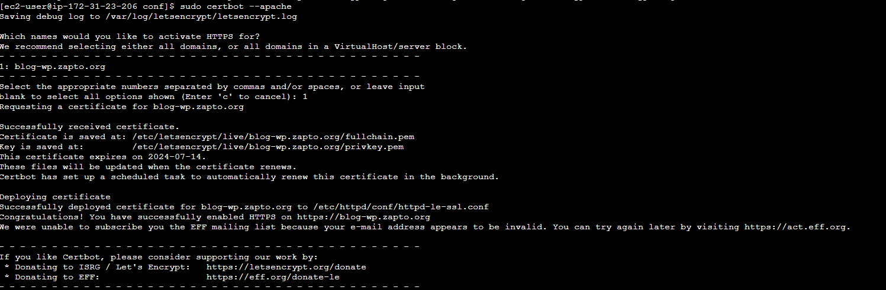

## Habilitar SSL

### 1. Instalar certbot

```console
sudo yum install certbot
```

### 2. Registrarse y crear un dominio en [no-ip](https://www.noip.com/) y asignar la IP pública de la instancia EC2.

### 3. Editar el fichero /etc/httpd/conf/httpd.conf y despues de Listen 80, pegar:

<VirtualHost *:80>
    DocumentRoot "/var/www/html"
    ServerName "example.org"
    ServerAlias "example.org"
</VirtualHost>

*Reemplazar example.org por tu dominio*

3. Crear certificado con Let's Encrypt

```console
sudo certbot --apache
```



*Seleccionar el dominio para generar el certificado y configurar Apache Web Server*